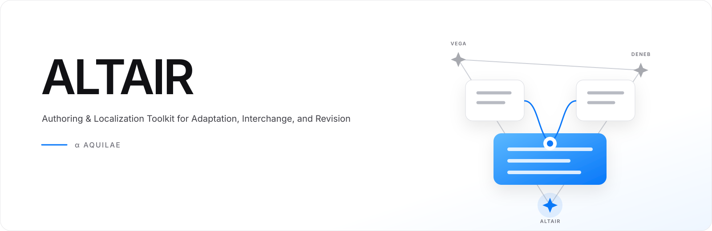

# Altair

[English](README.md) · [简体中文](README.zh-CN.md) · [繁體中文](README.zh-TW.md) · [日本語](README.ja.md) · [한국어](README.ko.md)



**ALTAIR** — **A**uthoring & **L**ocalization **T**oolkit for **A**daptation, **I**nterchange, and **R**evision

Altair는 비주얼 노벨 저작 및 현지화 도구입니다. 장면, 대사, 에셋, 언어, 미리보기와
스토리 흐름을 하나의 편집 가능한 작업 공간에 모읍니다.

## 할 수 있는 일

- 시각적 컨트롤로 대사와 스토리 동작 편집
- 원하는 수의 작품 언어와 글꼴 관리
- 편집 중인 장면을 Vega로 바로 미리보기
- 플러그인으로 프로젝트 형식 가져오기, 변환과 내보내기
- 에셋, 흐름도, 이력, 초안과 플러그인 관리

작품 언어는 제작자가 설정합니다. 외부 소스의 언어와 서버 규칙은 해당 플러그인이
처리합니다.

## 시작하기

[First Light](https://github.com/haneoka-gakuen/vega-example-first-light)는
Altair에서 바로 열 수 있는 예제 프로젝트입니다.

```sh
pnpm install --frozen-lockfile
pnpm dev
```

재생에는 [Vega](https://github.com/haneoka-gakuen/vega),
배포 빌드에는 [Deneb](https://github.com/haneoka-gakuen/deneb)을 사용합니다.

Altair는 MPL-2.0으로 배포됩니다.
